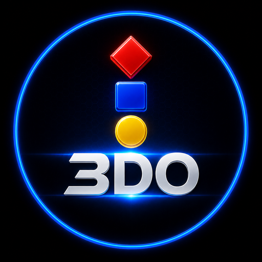
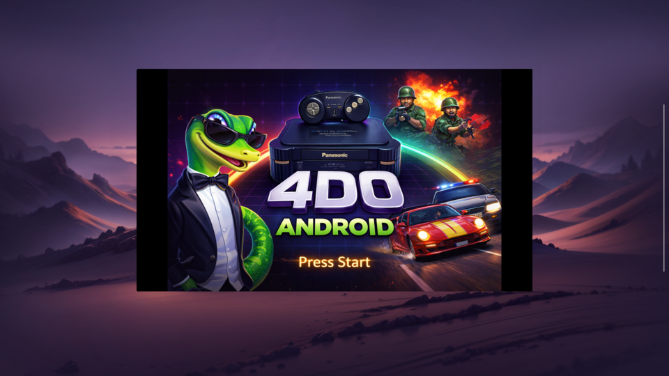
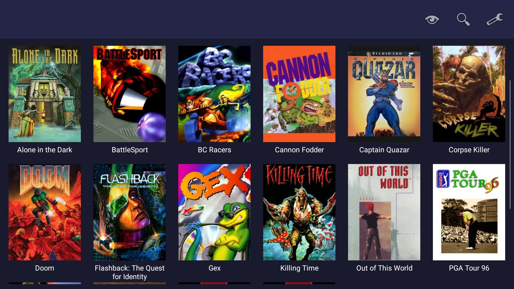
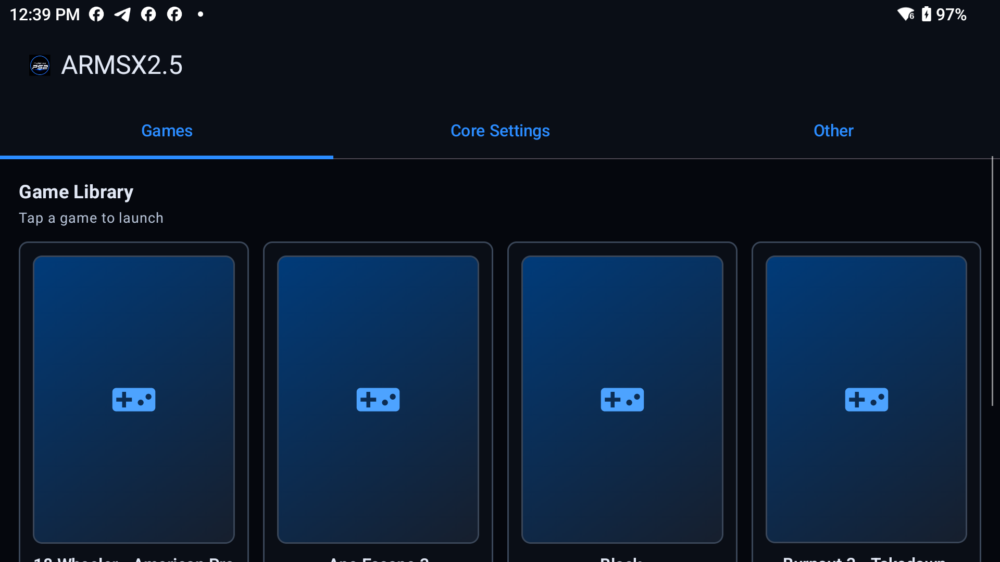
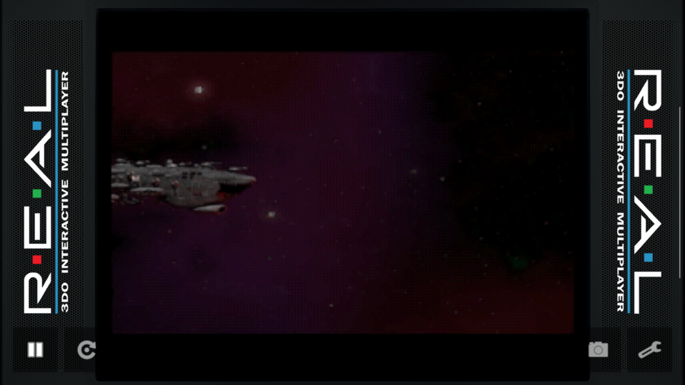

# 4DO Android

Android port of the **Opera** emulator (a fork of 4DO) with a Java UI and native emulator/rendering code — a free, open-source emulator for 3DO software with broad Android compatibility across phones, tablets, foldables, and handheld devices.

## Download

**[Get it on Google Play](https://play.google.com/store/apps/details?id=com.fourdo.android)** — requires Android 7.0 (API 24) or later.

For documentation and more information, visit the **[4DO Android Documentation site](https://crownparkcomputing.github.io/4DO-Android/)**.

## What's New in v2.0.6

- **Fixed sideways / mirrored display** on Vulkan devices — games now render upright and correctly oriented.
- **Major performance boost** — the emulator core is fully optimized, and rendering is decoupled from the display refresh for smoother, faster gameplay.
- **New 3DO app icon.**
- **Redesigned controller mapper** — a clean, colour-coded button layout.
- **Removed the manual display-rotate control** — orientation is now always correct automatically.

**[Update on Google Play »](https://play.google.com/store/apps/details?id=com.fourdo.android)**

## Screenshots

| | |
|---|---|
|  |  |
|  |  |

## Features

- **Accurate 4DO-based emulation** with broad Android device support
- **On-screen controller** support for touchscreen input
- **External controller** support via Bluetooth gamepads
- **Software and hardware rendering** options (OpenGL/Vulkan)
- **Game library** with box art from IGDB
- **Saves management** and state snapshots

## License

The core emulator logic is based on **Opera**, which is a fork of **4DO**, and is licensed under the **LGPL v2.1**. The Android-specific frontend and UI code are provided under the MIT License. See the [LICENSE](LICENSE) file for details.

## Acknowledgements

- **FreeDO**: The original 3DO emulator by Alexander64, Maxim Grishin, Andrey Tkachuk, Viktor Sen'ko (johnnydude), and others.
- **4DO**: Built upon FreeDO by **Viktor "johnnydude" Sen'ko**.
- **Opera**: An optimized fork of 4DO maintained by the [Opera-Libretro](https://github.com/libretro/opera-libretro) community.
- **Opera Android**: This project is an Android port/frontend for the Opera core.
- **Tapwave Zodiac** and broader 3DO preservation community.
- All contributors.
